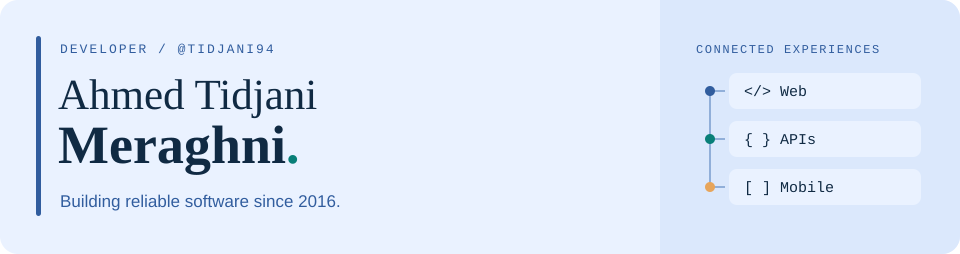

  

<h3 align="center">Full-stack web &amp; mobile developer · PHP &amp; Laravel specialist</h3>

  

I build and maintain web applications, APIs, content platforms, and mobile experiences, with professional experience since **2016**. My core focus is **PHP and Laravel**: clear architecture, dependable integrations, and software that stays maintainable as it grows.

I work with the **[Coodiv](https://coodiv.net)** team on practical digital products and long-term software solutions.

## Selected work

### [KnissRadar ↗](https://github.com/tidjani94/KnissRadar)

Price tracking for Ouedkniss: listing history, price-drop alerts, and comparisons across sellers. A browser extension backed by an API and background workers.

`React` · `TypeScript` · `Node.js` · `Fastify` · `PostgreSQL` · `Redis`

### [HealthLens ↗](https://github.com/tidjani94/HealthLens-public)

A local-first WordPress plugin that helps site owners spot important problems and understand what to do next. Public documentation and an issue tracker make support easier to navigate.

`PHP` · `WordPress`

## My toolkit

| Area | Technologies |
| :--- | :--- |
| **Backend & APIs** | PHP · Laravel · Symfony · Node.js · REST APIs |
| **Frontend** | JavaScript · TypeScript · React · Vue.js · Tailwind CSS · Bootstrap |
| **Mobile & CMS** | Flutter · Android · WordPress |
| **Data** | MySQL · PostgreSQL · MongoDB |
| **Infrastructure** | Docker · AWS · Nginx · Apache · Linux |

**Workflow:** Git · GitHub · GitLab · Jira · Notion

## What I bring to a project

- **Web applications:** full-stack development from backend logic to the user interface.
- **Application architecture:** PHP and Laravel systems built for ongoing maintenance.
- **Integrations:** REST APIs and backend services that connect products and workflows.
- **Mobile experiences:** applications designed around the people using them.

## Let's connect

For a project conversation or collaboration, **[message me on WhatsApp](https://wa.me/213671584352)**.

**WhatsApp:** [+213 671 584 352](https://wa.me/213671584352) · **Team:** [Coodiv](https://coodiv.net) · **GitHub:** [@tidjani94](https://github.com/tidjani94)
